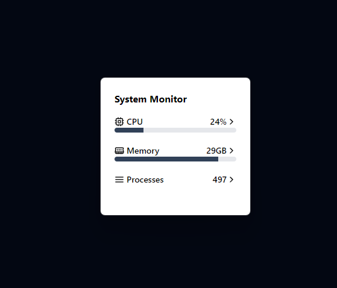

# Windows System Monitor

An electron-based Windows widget to monitor system resources

Built using React, TypeScript, Electron, Electron Builder and Vite.

## Features

- CPU Utilization
- Memory Utilization
- Top processes Utilization
- Minimize to tray

## Getting started

- Clone the repo and run `npm run dev` in your terminal

## Distributing

- For producing a Windows distribution run `npm run dist:win`

The app can easily be extended to release on MacOS and Linux. It's fully set-up to do so with all system monitoring parameters supported.
